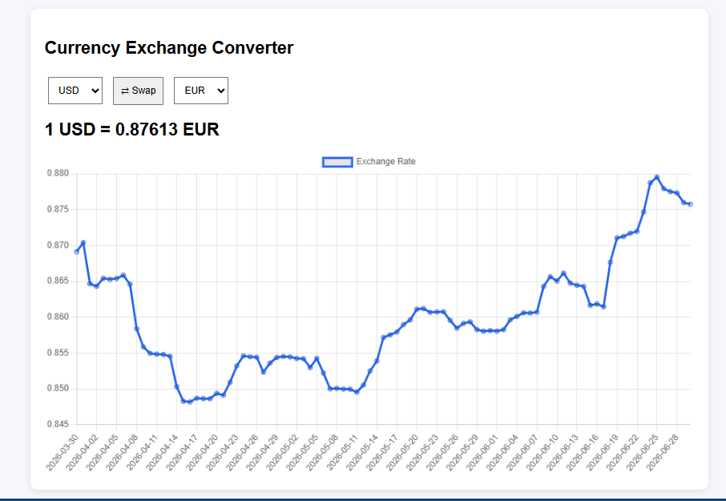
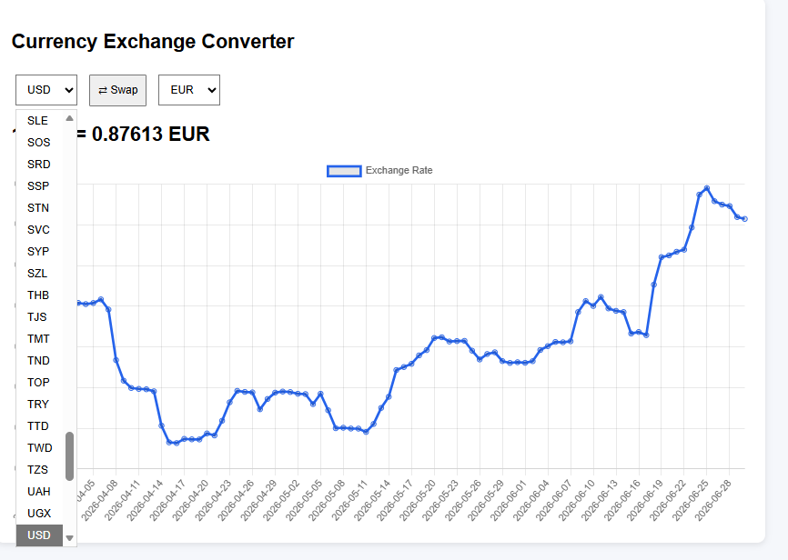
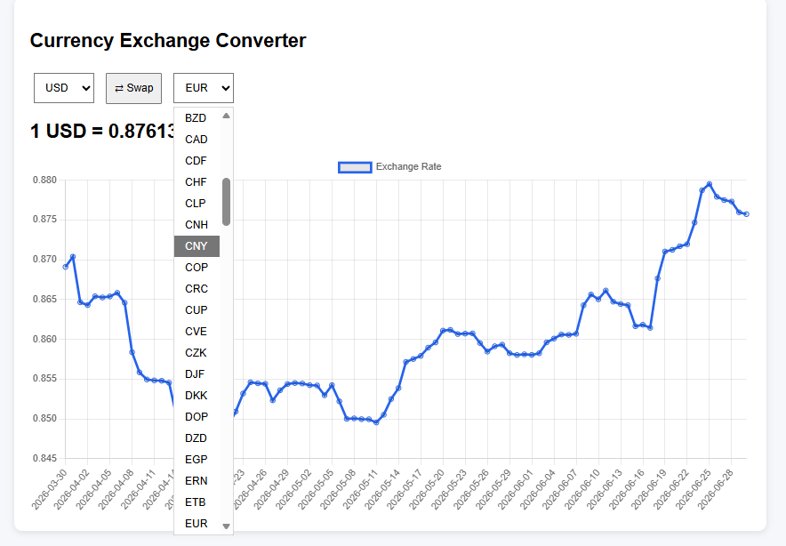
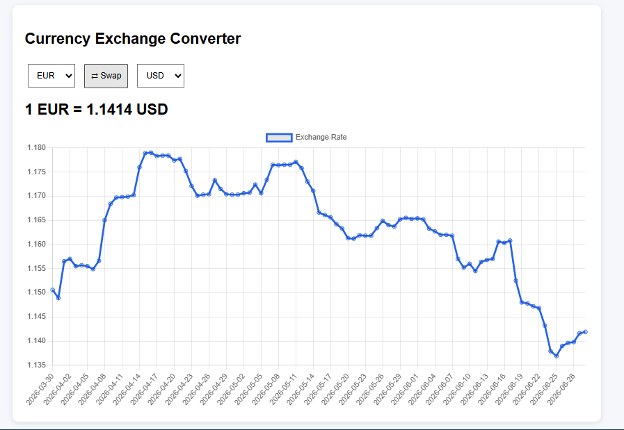

# Magento 2 Currency Exchange Converter Module
Route: /currencyconverter
Uses Frankfurter currencies, latest rates, swap control.

# Clone the Repository:
```bash
git clone https://github.com/ankitabiswas03/magento2-currency-converter.git
```

# Install Module:
Copy the desired module folder into your Magento 2 installation's app/code directory.

Enable the module using Magento CLI:
```bash
php bin/magento setup:upgrade
```

# Frontend Output:
Hit the Controller path /currencyconverter, below page will appear


Now, we can select any Currencies from the dropdown lists (From & To)



After clicking on swap button, the output changes and chart looks like



